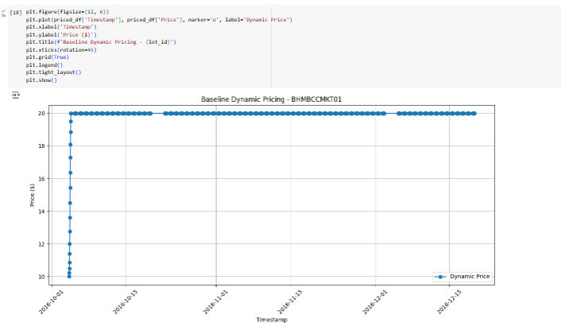

**Dynamic Pricing for Urban Parking Lots**

*Capstone Project (Summer Analytics 2025)*
*hosted by **Consulting & Analytics Club × Pathway***

This project presents a dynamic, real time parking pricing engine using Python and visualized with Bokeh. It explores three distinct pricing models: Linear, Demand Based and Competitive and each offering a unique strategy to optimize parking costs based on varying conditions.

*Tech Stack*

- Python 
- Pandas & NumPy: for prepreprocessing and computation
- CSV & JSONL formats: for streaming data
- Bokeh: for interactive visualizations
- Matplotlib: for quick data inspection and backup static plots.
- Google Colab: development environment
- Pathway: for real time data processing

*Architecture Diagram*


*Project Visuals*

  
  <br>
  
  <br>
  
  <br>

*Project Architecture & Workflow*

1. Data Ingestion:
- Parking lot data is loaded from a CSV file.
- Fields include occupancy, capacity, vehicle type, queue length, traffic condition and whether it’s a special day.
2. Model 1: Linear Pricing
- Prices increase linearly with lot utilization.
- Simple and interpretable.
3. Model 2: Demand Based Pricing
- Takes into account: Queue length, Traffic condition, Vehicle type (with weights), Special day status.
- Demand is normalized and scaled to output a fair, capped price (₹5–₹20).
4. Model 3: Competitive Pricing
- Compares pricing with nearby lots using geo coordinates.
- Uses haversine distance to adjust price based on surrounding congestion.
5. Output Generation
- Each pricing strategy outputs a new column: ```price_linear```, ```price_demand``` and ```price_competitive```
6. Visualization
- Bokeh is used to create an interactive line plot comparing all 3 models.
- Users can toggle visibility of each model.

*Folder Structure*

```
dynamic-parking-py-bokeh-pricing/
├── dataset.csv
├── images/
│   └── image1.png
│   └── image2.png
│   └── image3.png
│   └── image4.png
│   └── image5.png
├──architecture-digram.png
├── project.ipynb
├── README.md
├── requirements.txt
```

*Documentation*

- Model notebooks structured by folder
- Well documented code cells
- Architecture diagram 
- Final visualization graph 

*How to Run*

- Clone the repository or open ```.ipynb``` files in Google Colab
- Install required packages:
  
    ```
    pip install -r requirements.txt
    ```
    
- Run each model notebook inside its respective folder
- View final visualizations in the last cells or under ```/images/```

*Acknowledgements*

Special thanks to the mentors and organizing team of Summer Analytics 2025, Consulting & Analytics Club, IIT Guwahati × Pathway 

*Author*

[LinkedIn](https://www.linkedin.com/in/mansi-ruhil-7a00a0228/) 

[GitHub](https://github.com/mansiruhil)  

[MailMe](mailto:mansiruhil99@gmail.com)  

© 2025 CAC × Pathway Capstone Project
